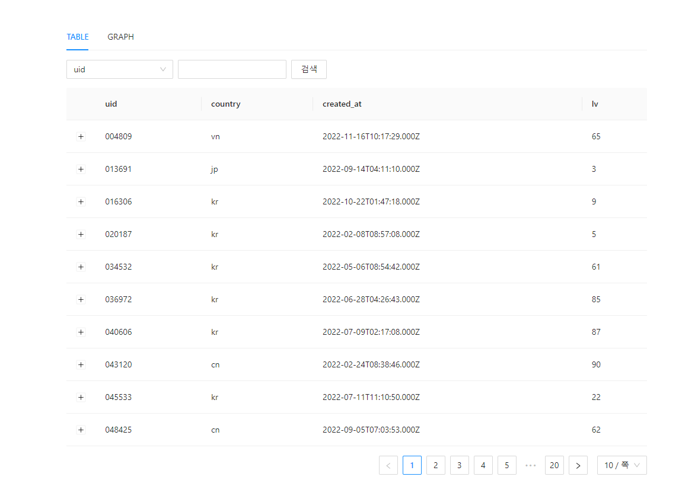
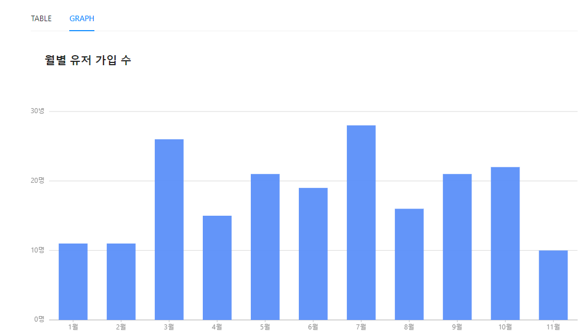

# About

This is a sample React project written in TypeScript.

## Built with

- [TypeScript](https://www.typescriptlang.org/)
- [ReactJS](https://reactjs.org/)
- [React Query](https://react-query-v3.tanstack.com/)
- [Ant Design](https://ant.design/)

## Table Page Functionality

- Display data
- Display specific data through search filters
- Change number of data displayed through pagination options

## Graph Page Functionality

- Display certain properties of data visually
